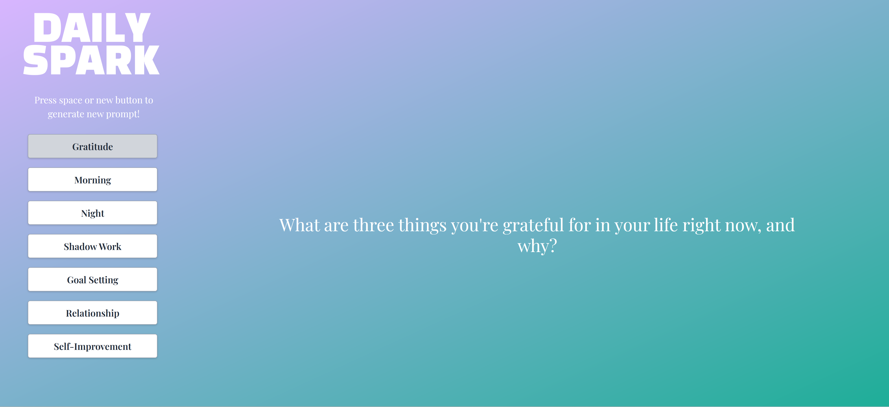

# Daily Spark

## About
Daily Spark is a journal prompt generator built using Python Flask and Tailwind CSS. It provides users with journal prompts to spark creativity, self-reflection, and personal growth.

## Check it out here!!!
http://adeniro.pythonanywhere.com/

## Technologies Used

- **Python**: Backend logic and server-side scripting using Flask framework.
- **HTML/CSS/JavaScript**: Frontend development for user interface and interactivity, with styling powered by Tailwind CSS.
- **Git/GitHub**: Version control and collaborative development.
- **PythonAnywhere**: Hosting platform for deploying and running the Flask application.
